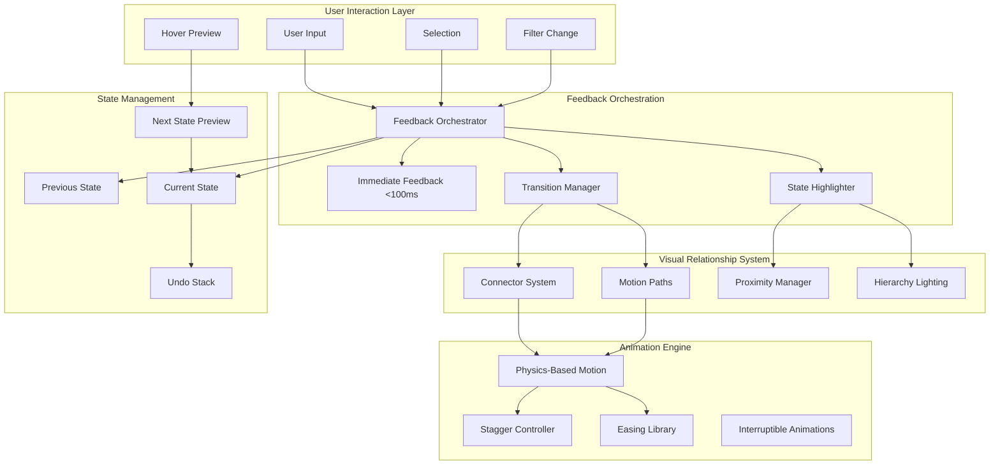

# Design Document: Clarity-First, Responsibility-Driven UX

## Overview

This design transforms the RailTime transit application into a "transparent instrument panel" where every interaction teaches users what happened, why it happened, and what will happen next. The redesign applies a clarity-first philosophy across all UI components, creating an experience that feels like a calm thinking partner rather than a noisy machine.

The design introduces a new visual system with meaningful microinteractions, relationship-aware layouts, and ethical feedback patterns that prioritize user understanding over engagement metrics.

## Architecture



## Components and Interfaces

### 1. Feedback Orchestrator

Central system that coordinates all visual feedback for user actions.

```typescript
interface FeedbackOrchestrator {
  // Register an action and trigger appropriate feedback
  triggerFeedback(action: UserAction, context: ActionContext): void;
  
  // Queue feedback for batched updates
  queueFeedback(feedback: FeedbackItem[]): void;
  
  // Cancel pending feedback (for interrupted actions)
  cancelPending(actionId: string): void;
}

interface UserAction {
  type: 'select' | 'filter' | 'hover' | 'swap' | 'refresh' | 'expand';
  target: string;           // Element ID or selector
  timestamp: number;
  metadata?: Record<string, unknown>;
}

interface ActionContext {
  previousState: UIState;
  currentState: UIState;
  affectedElements: string[];
  relationships: ElementRelationship[];
}

interface FeedbackItem {
  type: 'highlight' | 'animate' | 'connect' | 'reveal' | 'dim';
  target: string;
  duration: number;
  delay: number;
  easing: EasingFunction;
  interruptible: boolean;
}
```

### 2. Visual Connector System

Creates visible relationships between UI elements.

```typescript
interface ConnectorSystem {
  // Create a visual connection between elements
  connect(from: string, to: string, style: ConnectorStyle): ConnectorId;
  
  // Update connector when elements move
  updateConnector(id: ConnectorId): void;
  
  // Remove connector with optional fade animation
  disconnect(id: ConnectorId, animate?: boolean): void;
  
  // Highlight a connection temporarily
  pulseConnection(id: ConnectorId, intensity: number): void;
}

interface ConnectorStyle {
  type: 'line' | 'curve' | 'glow' | 'proximity' | 'motion-trail';
  color: string;
  opacity: number;
  width: number;
  animated: boolean;
  dashPattern?: number[];
}

type ConnectorId = string;
```

### 3. Motion Path System

Handles physics-based animations that convey meaning.

```typescript
interface MotionPathSystem {
  // Animate element along a meaningful path
  animateAlongPath(
    element: string,
    path: MotionPath,
    options: MotionOptions
  ): AnimationController;
  
  // Create a "pull forward" effect for filtering
  pullForward(elements: string[], intensity: number): void;
  
  // Create a "release backward" effect for filtering
  releaseBackward(elements: string[], intensity: number): void;
  
  // Swap two elements with crossing motion
  swapWithCross(elementA: string, elementB: string): void;
}

interface MotionPath {
  type: 'linear' | 'arc' | 'spring' | 'gravity';
  from: Position;
  to: Position;
  controlPoints?: Position[];
}

interface MotionOptions {
  duration: number;
  easing: EasingFunction;
  stagger?: number;        // Delay between multiple elements
  physics?: PhysicsConfig;
  interruptible: boolean;
}

interface PhysicsConfig {
  mass: number;
  stiffness: number;
  damping: number;
  velocity: number;
}
```

### 4. State Highlighter

Manages visual state indication and relationships.

```typescript
interface StateHighlighter {
  // Highlight selected element and dim others
  highlightSelection(selected: string, others: string[]): void;
  
  // Show affected elements when action occurs
  showAffected(elements: string[], intensity: 'subtle' | 'moderate' | 'strong'): void;
  
  // Preview state on hover
  previewState(element: string, previewState: PreviewState): void;
  
  // Clear all highlights
  clearHighlights(animate?: boolean): void;
  
  // Show relationship between elements
  showRelationship(from: string, to: string, type: RelationshipType): void;
}

interface PreviewState {
  highlight: boolean;
  showConnector: boolean;
  previewContent?: ReactNode;
  dimOthers: boolean;
}

type RelationshipType = 'selection' | 'filter' | 'dependency' | 'sequence';
```

### 5. Progressive Disclosure Controller

Manages cognitive load through staged information reveal.

```typescript
interface ProgressiveDisclosure {
  // Register a disclosure group
  registerGroup(groupId: string, config: DisclosureConfig): void;
  
  // Expand to show more detail
  expand(groupId: string, level: number): void;
  
  // Collapse to reduce detail
  collapse(groupId: string): void;
  
  // Get current disclosure level
  getLevel(groupId: string): number;
}

interface DisclosureConfig {
  levels: DisclosureLevel[];
  defaultLevel: number;
  animationStyle: 'fade' | 'slide' | 'stagger';
  preserveContext: boolean;  // Keep parent visible when expanding
}

interface DisclosureLevel {
  level: number;
  elements: string[];
  trigger?: 'click' | 'hover' | 'scroll';
}
```

### 6. Calm Feedback System

Provides honest, non-anxious feedback.

```typescript
interface CalmFeedback {
  // Show loading state with honest progress
  showLoading(config: LoadingConfig): LoadingController;
  
  // Show success confirmation
  confirmSuccess(message: string, options?: ConfirmOptions): void;
  
  // Show error with recovery options
  showError(error: ErrorInfo, recoveryOptions: RecoveryOption[]): void;
  
  // Show undo option
  showUndo(action: string, undoFn: () => void, timeout: number): void;
  
  // Update data with change indication
  showDataUpdate(changes: DataChange[]): void;
}

interface LoadingConfig {
  type: 'determinate' | 'indeterminate';
  message?: string;
  showProgress: boolean;
  cancelable: boolean;
}

interface ErrorInfo {
  title: string;
  description: string;
  severity: 'info' | 'warning' | 'error';
  technical?: string;  // Optional technical details
}

interface RecoveryOption {
  label: string;
  action: () => void;
  primary: boolean;
}

interface DataChange {
  elementId: string;
  field: string;
  oldValue: unknown;
  newValue: unknown;
  highlightDuration: number;
}
```

## Data Models

### UI State Model

```typescript
interface UIState {
  // Selection state
  selectedTrain: string | null;
  hoveredTrain: string | null;
  
  // Filter state
  filters: {
    origin: string | null;
    destination: string | null;
    timeFilter: TimeFilterState | null;
  };
  
  // Disclosure state
  disclosureLevels: Record<string, number>;
  
  // Feedback state
  activeAnimations: AnimationState[];
  activeConnectors: ConnectorState[];
  highlightedElements: string[];
  
  // Undo state
  undoStack: UndoableAction[];
  
  // Data freshness
  lastUpdate: number;
  dataSource: 'live' | 'scheduled' | 'cached';
}

interface AnimationState {
  id: string;
  target: string;
  type: string;
  progress: number;
  interruptible: boolean;
}

interface ConnectorState {
  id: string;
  from: string;
  to: string;
  style: ConnectorStyle;
  visible: boolean;
}

interface UndoableAction {
  id: string;
  description: string;
  timestamp: number;
  undo: () => void;
  expiresAt: number;
}
```

### Animation Configuration

```typescript
interface AnimationConfig {
  // Standard durations (in ms)
  durations: {
    instant: 0;
    fast: 150;
    normal: 300;
    slow: 500;
    deliberate: 800;
  };
  
  // Physics-based easing presets
  easings: {
    // Smooth deceleration (arriving)
    easeOut: 'cubic-bezier(0.0, 0.0, 0.2, 1)';
    // Smooth acceleration (departing)
    easeIn: 'cubic-bezier(0.4, 0.0, 1, 1)';
    // Natural movement
    easeInOut: 'cubic-bezier(0.4, 0.0, 0.2, 1)';
    // Spring-like bounce
    spring: 'cubic-bezier(0.34, 1.56, 0.64, 1)';
    // Gravity-like fall
    gravity: 'cubic-bezier(0.55, 0.085, 0.68, 0.53)';
  };
  
  // Stagger delays for lists
  stagger: {
    tight: 30;
    normal: 50;
    relaxed: 80;
  };
}
```

### Visual Language Tokens

```typescript
interface ClarityDesignTokens {
  colors: {
    // Grounded neutrals
    background: {
      primary: '#FAFBFC';
      secondary: '#F4F6F8';
      elevated: '#FFFFFF';
    };
    
    // Text hierarchy
    text: {
      primary: '#1A1D21';
      secondary: '#5E6670';
      muted: '#8B939E';
      inverse: '#FFFFFF';
    };
    
    // Meaningful accents (used sparingly)
    accent: {
      selection: '#2563EB';      // Clear selection state
      success: '#059669';        // Confirmed/live
      warning: '#D97706';        // Attention needed
      info: '#0891B2';           // Informational
    };
    
    // Relationship indicators
    relationship: {
      connector: 'rgba(37, 99, 235, 0.3)';
      highlight: 'rgba(37, 99, 235, 0.08)';
      affected: 'rgba(37, 99, 235, 0.12)';
    };
    
    // State changes
    change: {
      added: 'rgba(5, 150, 105, 0.15)';
      updated: 'rgba(37, 99, 235, 0.15)';
      removed: 'rgba(220, 38, 38, 0.1)';
    };
  };
  
  elevation: {
    // Soft, grounded shadows
    none: 'none';
    subtle: '0 1px 2px rgba(0, 0, 0, 0.04)';
    low: '0 2px 4px rgba(0, 0, 0, 0.06)';
    medium: '0 4px 8px rgba(0, 0, 0, 0.08)';
    high: '0 8px 16px rgba(0, 0, 0, 0.10)';
  };
  
  spacing: {
    // Consistent rhythm
    xs: '4px';
    sm: '8px';
    md: '16px';
    lg: '24px';
    xl: '32px';
    xxl: '48px';
  };
  
  typography: {
    // Optimized for scanning
    fontFamily: {
      primary: 'Inter, system-ui, sans-serif';
      mono: 'JetBrains Mono, monospace';
    };
    
    sizes: {
      xs: '12px';
      sm: '14px';
      base: '16px';
      lg: '18px';
      xl: '24px';
      xxl: '32px';
    };
    
    weights: {
      normal: 400;
      medium: 500;
      semibold: 600;
    };
    
    lineHeights: {
      tight: 1.25;
      normal: 1.5;
      relaxed: 1.75;
    };
  };
  
  borders: {
    radius: {
      sm: '4px';
      md: '8px';
      lg: '12px';
      full: '9999px';
    };
    
    width: {
      thin: '1px';
      medium: '2px';
    };
  };
  
  motion: {
    // Feedback timing
    feedbackDelay: 0;           // Immediate
    maxFeedbackDelay: 100;      // Must respond within 100ms
    
    // Transition defaults
    transitionDuration: 300;
    
    // Interruptibility
    interruptThreshold: 50;     // Can interrupt after 50ms
  };
}
```


## Correctness Properties

*A property is a characteristic or behavior that should hold true across all valid executions of a system-essentially, a formal statement about what the system should do. Properties serve as the bridge between human-readable specifications and machine-verifiable correctness guarantees.*

Based on the prework analysis, the following correctness properties have been identified. Redundant properties have been consolidated for efficiency.

### Property 1: Selection Dialogue Sequence

*For any* train selection action, the system must execute a visual dialogue sequence where: (1) the selected train receives highlight styling, (2) the details panel becomes visible, and (3) a visual connector element exists linking the selection to the details.

**Validates: Requirements 1.1, 8.1**

### Property 2: Filter Transformation Animation

*For any* filter change (station or time), the system must animate the transition rather than instantly changing state, with matching elements receiving "pull forward" animation classes and non-matching elements receiving "release backward" or fade-out classes.

**Validates: Requirements 1.2, 1.3, 2.2, 8.2**

### Property 3: Data Change Highlighting

*For any* background data refresh that modifies displayed values, the changed elements must receive a temporary highlight class indicating the update.

**Validates: Requirements 1.4**

### Property 4: Hover Preview State

*For any* hoverable interactive element, hovering must trigger a preview state that shows what will happen if the user commits to the action, through highlight, tooltip, or state preview.

**Validates: Requirements 1.5, 8.3**

### Property 5: Coordinated Animation Timing

*For any* train selection, connected elements (details panel, route visualization) must animate with coordinated timing where the sequence is: selection highlight → panel slide → content reveal with stagger.

**Validates: Requirements 2.1, 2.5**

### Property 6: Swap Animation Direction

*For any* origin/destination swap action, the system must animate the swap with a crossing or rotation motion that visually represents the reversal.

**Validates: Requirements 2.3**

### Property 7: Status Transition Animation

*For any* train status change (e.g., Scheduled → Live), the status indicator must transition with a meaningful animation (pulse or glow) rather than instant change.

**Validates: Requirements 2.4**

### Property 8: Feedback Timing Constraint

*For any* user action, the system must provide visual feedback within 100ms of the action being triggered.

**Validates: Requirements 3.1**

### Property 9: Honest Loading Indicators

*For any* loading state, the progress indicator must reflect actual loading state: determinate progress when known, indeterminate when unknown, with no fake progress animations.

**Validates: Requirements 3.2**

### Property 10: Calm Error Messages

*For any* error displayed to the user, the message must: (1) contain at least one recovery option, (2) not contain anxiety-inducing words (e.g., "critical", "urgent", "immediately", "warning"), and (3) use factual, actionable language.

**Validates: Requirements 3.3**

### Property 11: Undo Availability

*For any* selection or filter action, the system must provide a visible undo option or the action must be easily reversible through the same control.

**Validates: Requirements 3.4**

### Property 12: Calm Language in Time Displays

*For any* time-sensitive information display, the text must not contain artificial urgency phrases (e.g., "hurry", "limited time", "act now", "don't miss").

**Validates: Requirements 3.5, 7.3**

### Property 13: Information Hierarchy

*For any* journey list item, essential information (train number, type, departure time, duration) must be visible by default, while secondary details must be hidden until requested.

**Validates: Requirements 4.1**

### Property 14: Progressive Disclosure for Details

*For any* train details display, stop-by-stop information must be collapsed by default and expand only when the user explicitly requests it.

**Validates: Requirements 4.3**

### Property 15: Visual Relationship Connectors

*For any* selected train, a visual connector element (line, glow, or proximity indicator) must exist between the train card and the details panel.

**Validates: Requirements 5.1**

### Property 16: Active Filter Indication

*For any* active filter state, a persistent visual indicator must show which filters are currently affecting the results.

**Validates: Requirements 5.2**

### Property 17: Route Path Visualization

*For any* displayed journey, a visual path or connection element must exist between the origin and destination stations.

**Validates: Requirements 5.3**

### Property 18: Information Containment

*For any* multi-train display, each train's information must be visually contained within a distinct boundary that clearly separates it from other trains.

**Validates: Requirements 5.5**

### Property 19: Accent Color Reservation

*For any* UI element using accent colors, the element must represent a meaningful state change (selection, success, warning, or info) rather than decoration.

**Validates: Requirements 6.1**

### Property 20: Soft Shadow Values

*For any* elevated element with shadows, the shadow values must be within the "soft" range (opacity ≤ 0.1, blur ≥ spread).

**Validates: Requirements 6.2**

### Property 21: Physics-Based Easing

*For any* animation in the system, the easing function must be a physics-based curve (ease-out, ease-in-out, spring, or gravity) rather than linear.

**Validates: Requirements 6.3**

### Property 22: Typography Hierarchy

*For any* text content, font sizes must follow a consistent hierarchy where headings > body > secondary, and line heights must be ≥ 1.25.

**Validates: Requirements 6.4**

### Property 23: No Dark Patterns

*For any* interactive element, it must not be hidden, use confusing language, or have manipulative defaults. All options must be equally accessible.

**Validates: Requirements 7.1**

### Property 24: No Artificial Urgency

*For any* non-critical information display, the system must not use countdown timers, scarcity messaging, or alarming colors (red/orange) unless the information is genuinely time-critical.

**Validates: Requirements 7.2**

### Property 25: Data Source Transparency

*For any* data display, a clear indicator must show the data source (Live, Scheduled, Cached) and its freshness.

**Validates: Requirements 7.4**

### Property 26: Action Reversibility

*For any* potentially destructive or significant action, the system must either show a confirmation dialog or provide an undo option.

**Validates: Requirements 7.5**

### Property 27: Pattern Consistency

*For any* set of similar UI elements (e.g., train cards, buttons, filters), the styling and interaction patterns must be consistent across all instances.

**Validates: Requirements 8.4**

### Property 28: Action Completion Feedback

*For any* completed user action, the system must provide visual confirmation that the action succeeded (e.g., checkmark, state change, confirmation message).

**Validates: Requirements 8.5**

### Property 29: Navigation Consistency

*For any* navigation action, the transition patterns and destination layouts must be consistent with established patterns in the application.

**Validates: Requirements 9.2**

### Property 30: Feature Discoverability

*For any* new or advanced feature, inline hints, tooltips, or contextual help must be available without requiring external documentation.

**Validates: Requirements 9.4**

### Property 31: Graceful Error Recovery

*For any* error or edge case, the UI must remain functional with clear recovery options, and the error must not break the user's ability to navigate or take other actions.

**Validates: Requirements 9.5**

## Error Handling

### Error Categories and Responses

| Error Type | User Message | Recovery Options | Visual Treatment |
|------------|--------------|------------------|------------------|
| Network timeout | "Taking longer than expected to load train data" | Retry, Use cached data | Subtle loading indicator, no alarm |
| API unavailable | "Live data temporarily unavailable. Showing scheduled times." | Refresh, View schedule | Info badge, not error state |
| No results | "No trains match your current filters" | Adjust filters, Clear filters | Calm empty state with guidance |
| Invalid input | "Please select a valid station" | Show valid options | Gentle highlight on field |
| Data stale | "Data last updated X minutes ago" | Refresh | Subtle timestamp, refresh option |

### Error Message Guidelines

1. **Use factual language**: "Connection interrupted" not "Error! Something went wrong!"
2. **Provide context**: Explain what the user was trying to do
3. **Offer recovery**: Always include at least one actionable option
4. **Avoid blame**: Never imply user error
5. **Stay calm**: No exclamation points, red text, or alarming icons for recoverable errors

## Testing Strategy

### Dual Testing Approach

This feature requires both unit tests and property-based tests to ensure correctness.

#### Unit Tests

Unit tests verify specific examples and edge cases:

- Selection of first/last train in list
- Filter with no matching results
- Swap when origin equals destination
- Error states for each error type
- Animation interruption scenarios
- Undo after timeout expiration

#### Property-Based Testing

Property-based tests verify universal properties using **fast-check** library for TypeScript.

Each property test must:
1. Generate random valid inputs (train selections, filter combinations, user actions)
2. Execute the action
3. Verify the property holds
4. Run minimum 100 iterations

**Test Annotation Format:**
```typescript
// **Feature: clarity-ux, Property 1: Selection Dialogue Sequence**
```

#### Key Property Tests

1. **Feedback Timing (Property 8)**: Generate random actions, measure feedback timing, verify < 100ms
2. **Animation Easing (Property 21)**: Generate random animations, extract easing, verify physics-based
3. **Calm Language (Properties 10, 12)**: Generate random error/time displays, verify no anxiety words
4. **Information Hierarchy (Property 13)**: Generate random journey data, verify essential info visible
5. **Pattern Consistency (Property 27)**: Generate random element sets, verify consistent styling

### Visual Regression Testing

For properties that involve visual appearance:
- Capture screenshots at key interaction points
- Compare against baseline images
- Flag visual regressions for review

### Accessibility Testing

All clarity-focused interactions must also be accessible:
- Screen reader announcements for state changes
- Keyboard navigation for all interactions
- Focus management during animations
- Reduced motion support for users who prefer it
